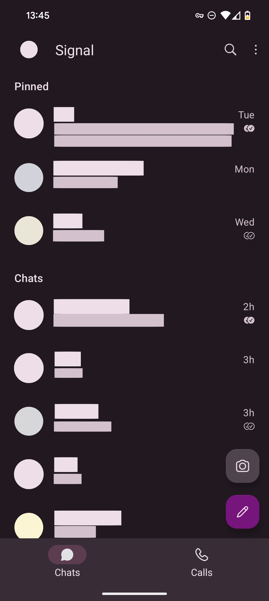
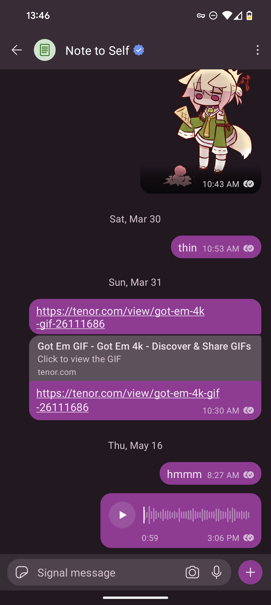
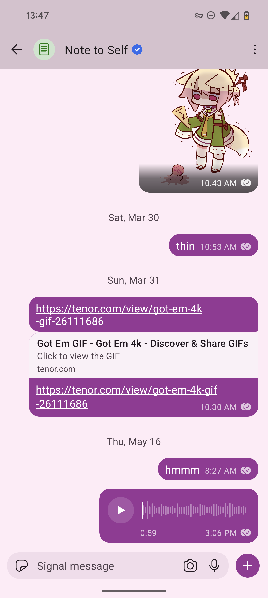

This is a personal fork of [a fork](https://github.com/johanw666/Signal-Android) of the [Android app for Signal](https://github.com/signalapp/Signal-Android) that uses Material You colours on Android 12+.

This also acts as a way for me to learn some Android development with an app that I actively use.

See the original README [here](README%20orig.md).

# Screenshots

